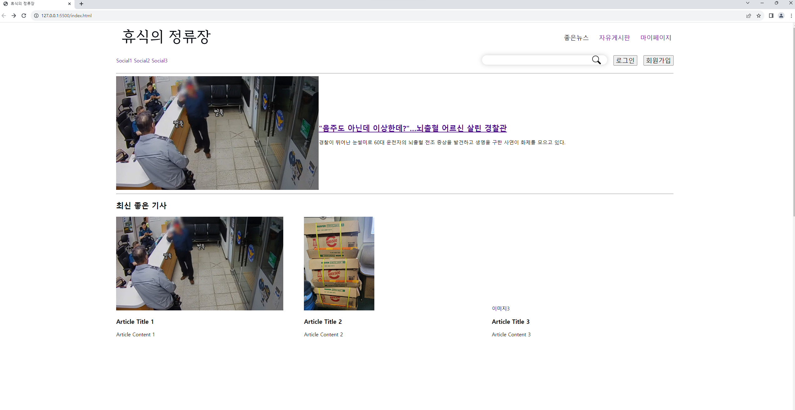
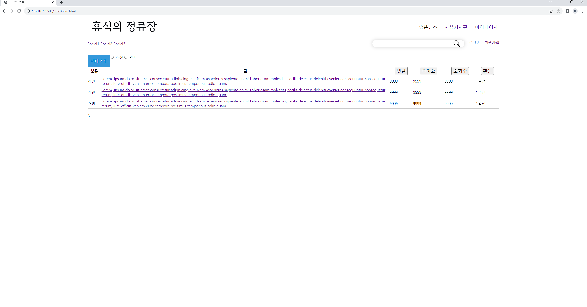
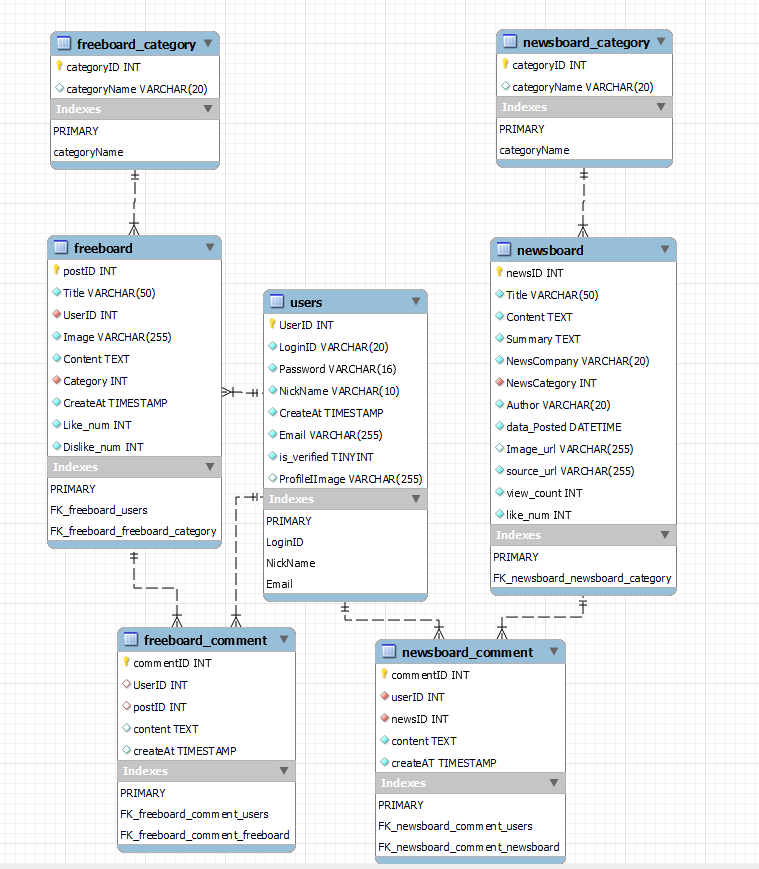
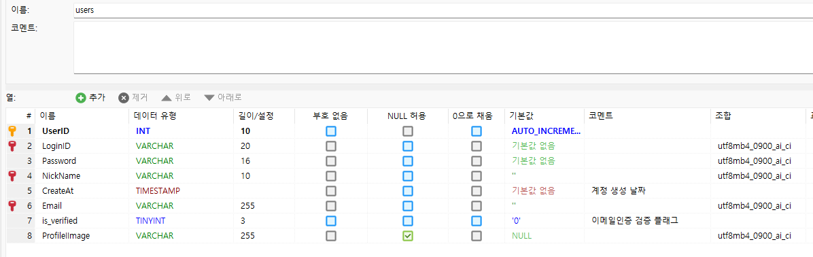
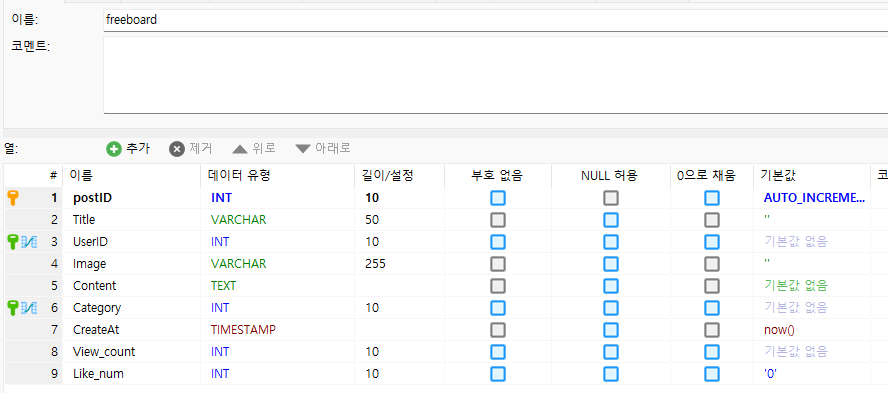
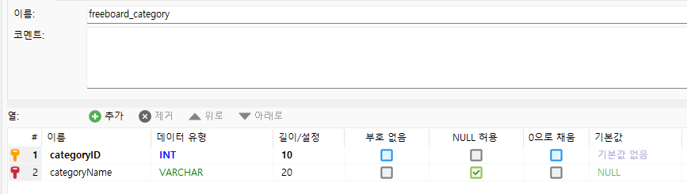
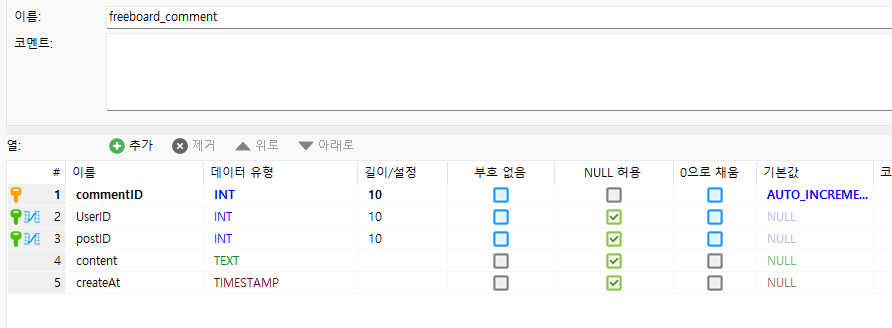
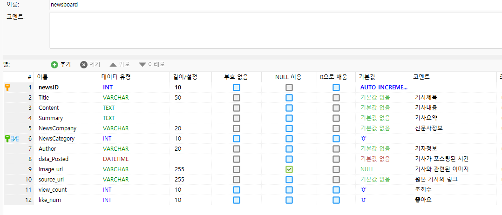
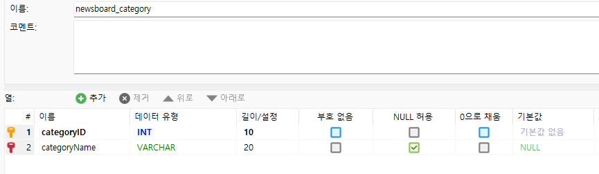
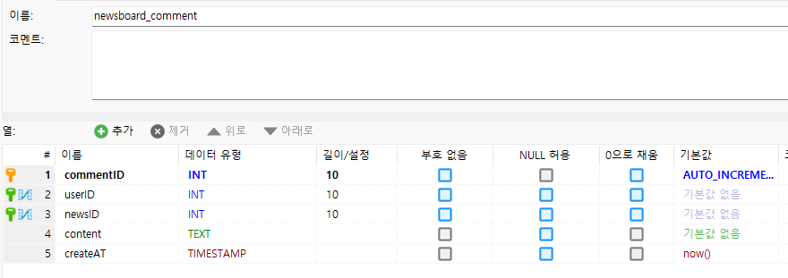

### NIPA 백엔드과정 프로젝트 서비스 주제 변경

### 서비스
요새 너무 흉흉한 일이 많아 (칼부림 등등) 좋은 기사, 훈훈한 기사, 마음이 따뜻해 지는 기사를 모아 제공하는 서비스
뉴스 기사에 대한 게시판이 존재하며, 유저가 직접 본인이 있었던 일 등을 게시할 수 있는 자유게시판이 존재한다.

- 추후 AI 수업 이후 기사의 감정판단 등으로 긍정도(?)판단 하여 목적에 맞는 기사 자동 업로드
- 게시판 목적에 맞지 않는 글 처리 (부정적이거나 분탕 등)
- 여러 언론사에서 기사를 받아올 때, 유사도 검증을 통해 같은 기사의 업로드를 막는다.

### HTML, CSS 구조 변경

일단은 메인페이지와 자유게시판 글 목록을 보여주는 HTML만 구현해봤다
아직 디자인적으로 완벽하지 않다. 기본 컴포넌트를 활용해서 미적으로 이쁘지 않다...
추가될점 : 글 작성 페이지, 글 내용 페이지 등

### DB 구성

#### USERS

---
### FREEBOARD

---
### FREEBOARD_CATEGORY

---
### FREEBOARD_COMMENT

---
### NEWSBOARD

---
### NEWSBOARD_CATEGORY

---
### NEWSBOARD_COMMNENT

---

